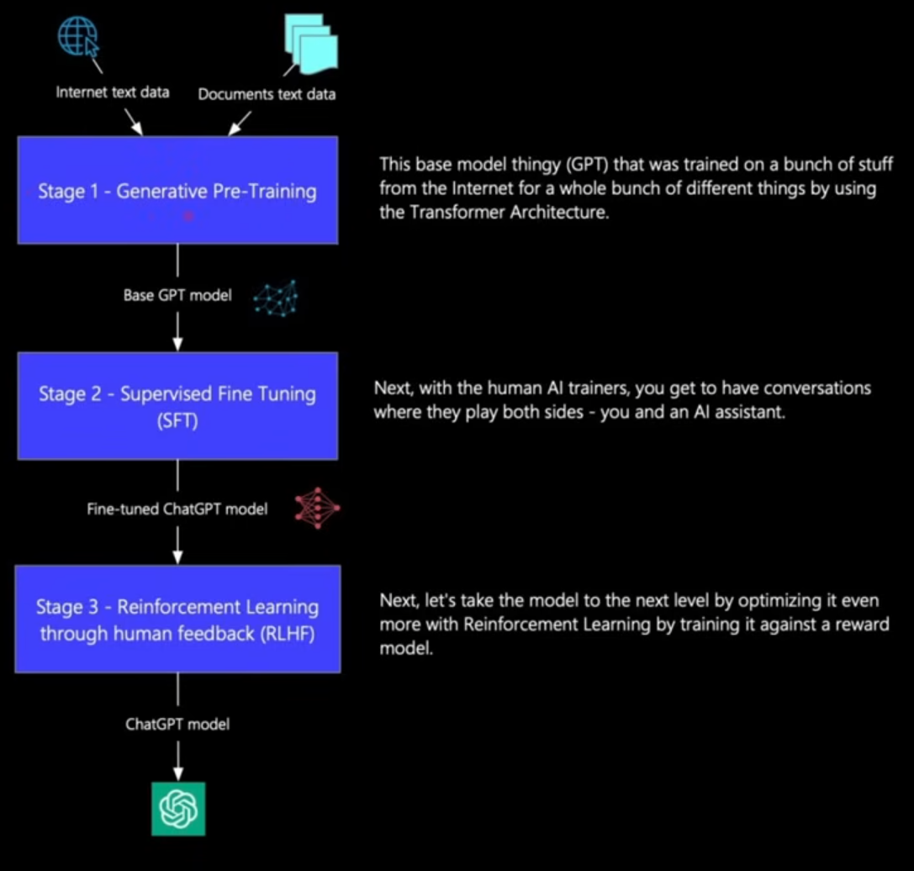
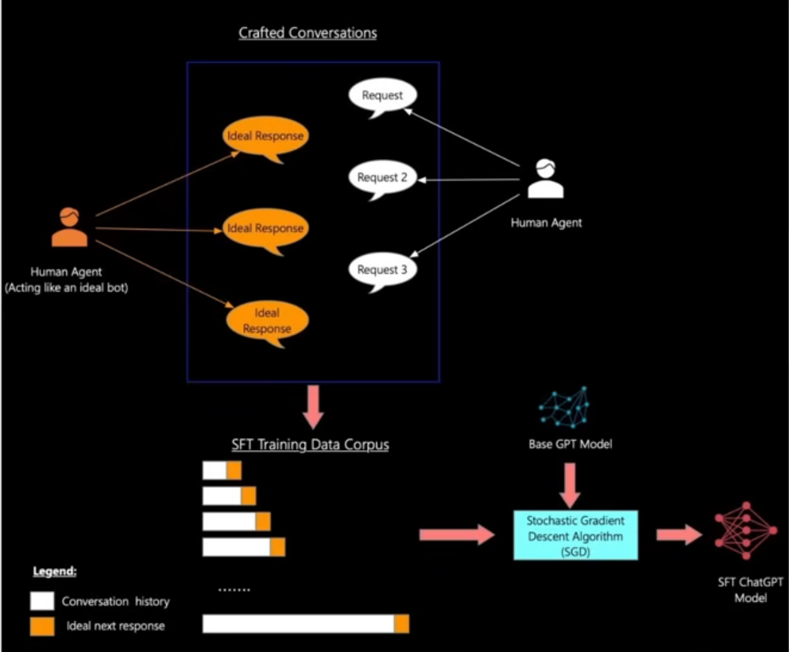
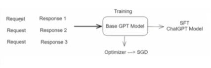

# How ChatGPT was trained?

ChatGPT and similar advanced Large Language Models (LLMs) are trained through a multi-stage process that leverages the Transformer architecture. The training process can be broadly broken down into three main stages: ***Pre-training, Supervised Fine-Tuning (SFT),*** and ***Reinforcement Learning from Human Feedback (RLHF).***

1. **Generative Pre-training (The Knowledge Foundation)**

    This is the initial, expensive, and massive-scale phase that gives the model its vast general knowledge and language understanding.

    * **Model**: The base model is a Generative Pre-trained Transformer (GPT), which uses a decoder-only version of the Transformer architecture. 
    * **Data**: The model is trained on a massive and diverse corpus of text gathered from the public internet, books, articles, and other sources (often billions or trillions of words/tokens).

    * **Task (Next-Word Prediction)**: The core task is unsupervised learning, where the model learns to predict the next word in a sentence given all the preceding words. For example, given "The cat sat on the...", the model learns that "mat" or "couch" is more likely than "sky" or "tree".

    * **Outcome**: After this stage, the model can generate grammatically correct and coherent text, showing a broad understanding of language patterns and factual knowledge, but it's not yet good at following specific user instructions or being conversational.

    

2. **Supervised Fine-Tuning (SFT) (Learning to Follow Instructions)**

    This second stage is where the general language model is adapted into an instruction-following chatbot.

    * **Data**: A specialized, high-quality dataset is created by human AI trainers. These trainers act as both the user (providing prompts/questions) and the ideal AI (writing the perfect, safe, and helpful response).

    * **Task (Imitation)**: The model is fine-tuned using supervised learning (learning from labeled examples) to mimic the style and behavior of the human-written responses. The model learns the mapping from an input prompt to the desired output response.

    **Outcome**: The model is now capable of giving high-quality, relevant, and helpful answers and is much better at understanding and following instructions than the base GPT model.

     
    
3. **Reinforcement Learning from Human Feedback (RLHF) (Alignment and Refinement)**

    This final and most crucial step aligns the model's behavior with human preferences, values, and instructions, making it conversational and safe.

    **A. Training the Reward Model (RM)**
    *   1. **Generate Responses**: For a large set of prompts, the SFT model generates multiple different possible responses.

        2. **Human Ranking**: Human reviewers rank these responses from best to worst (most helpful, safest, most relevant to the instruction).

        3. **Train the RM**: A separate machine learning model, called the Reward Model (RM), is trained on this human-ranked data. The RM learns to predict the human preference score (or "reward") for any given response based on the ranking data. The RM acts as a scalable, automated "judge" that scores the quality of future responses.

    **B. Fine-Tuning with Reinforcement Learning (RL)**
    *   1. **RL Algorithm**: The original SFT model (now called the Policy Model) is fine-tuned using an RL algorithm like Proximal Policy Optimization (PPO).

        2. **Maximize Reward**: The model generates a response, the Reward Model instantly gives it a high or low score, and the model then adjusts its internal parameters to maximize that score (the reward) in the future.

        3. **Outcome**: This process steers the model toward generating responses that are not just technically correct (from the pre-training) but are also judged by humans as being more helpful, less toxic, and better aligned with the user's intent—the key to the "ChatGPT feel".
