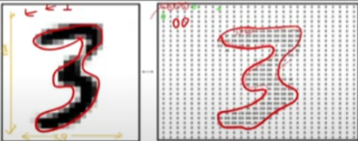

# Feature Extraction

This is the process of transforming raw data into a set of numerical features that can be processed by machine learning algorithms.

converting the text data into numerical representation often referred as ***vectorizing data***

Imagine you have a raw photograph. A computer doesn't "see" a cat or a dog; it sees a grid of pixel values (numbers representing color intensity). If you want a machine learning model to classify whether the photo contains a cat or a dog, giving it raw pixel values might be too complex and noisy.

Feature extraction would involve identifying and quantifying the most important aspects of that image:

* **Edges**: Are there distinct outlines?
* **Textures**: Is the fur smooth or ruffled?
* **Shapes**: Are there ear shapes, eye shapes?
* **Colors**: What are the dominant colors?

These extracted "features" (edges, textures, shapes, colors) are numerical representations that are more meaningful and digestible for the machine learning model than just the raw pixel values.

---

## Why is Feature Extraction Important?

*   **Dimensionality Reduction**: Raw data can often have a very high number of dimensions (e.g., thousands of pixels in an     image, thousands of words in a document). 

*   **Improved Model Performance**: By providing models with more meaningful and compact representations of the data, feature extraction can significantly enhance model accuracy, efficiency, and generalization capabilities. It helps the model focus on the truly predictive patterns and reduce noise.

*   **Handling Diverse Data Types**: Raw data comes in many forms (text, images, audio, time series, etc.). Feature extraction transforms these diverse data types into a standardized numerical format that machine learning algorithms can understand.

---

## 🔬 Feature Engineering vs. Extraction vs. Selection
These three concepts represent different stages and techniques for preparing data for a machine learning model.

1. **Feature Engineering (The Broader Concept)**

Feature Engineering is the overarching process of creating new features or transforming existing ones from raw data to improve model performance. It heavily relies on domain knowledge and creativity.

It encompasses:

*  *   **Feature Extraction**: Transforming high-dimensional data into a lower-dimensional set of new features.

    *  **Feature Creation**: Combining two or more original features to make a new one (e.g., calculating "price per square foot" from separate "price" and "square footage" columns).

    *  **Feature Transformation**: Adjusting the scale or distribution of features (e.g., scaling, normalization, logging).

---
## 🛠️ Common Feature Extraction Techniques by Data Type

The specific technique chosen for feature extraction depends heavily on the type of raw data you are working with.

### 📝 For Text Data (Natural Language Processing - NLP)
These techniques transform human language into a numerical format.

*   * **Bag-of-Words (BoW)**: Represents text as an unordered set (a "bag") of its words, simply keeping track of the frequency of each word. It ignores grammar and word order.

    * **TF-IDF (Term Frequency-Inverse Document Frequency)**: Assigns a weight to words. It highlights words that are frequent in a specific document (high Term Frequency) but rare across the entire dataset (high Inverse Document Frequency), making them more informative.

    * **Word Embeddings (e.g., Word2Vec, GloVe, BERT embeddings)**: Convert words into dense numerical vectors that capture the semantic relationship between words. Words with similar meanings have vectors that are close to each other in the vector space.

--

### 📷 For Image Data (Computer Vision)

These methods extract meaningful features like shapes, textures, and edges from pixels.

*   * **Traditional Methods (e.g., SIFT, SURF, HOG, LBP)**: Algorithms specifically designed to detect and describe local features such as edges, corners, and textures in an image.

    * **Deep Learning (Convolutional Neural Networks - CNNs)**: CNNs are highly effective at automatically learning hierarchical features directly from raw pixel data.

    * **Transfer Learning**: The output of intermediate layers in a pre-trained CNN (trained on a massive dataset) is often used as the extracted features for a new, related task.

--

### 🔢 For Numerical/Tabular Data

These techniques primarily focus on dimensionality reduction and separation.

*   * **Principal Component Analysis (PCA)**: A popular unsupervised dimensionality reduction technique. It transforms the data into a new set of orthogonal (uncorrelated) features called principal components, which are ordered by how much variance they capture.

    * **Linear Discriminant Analysis (LDA)**: Similar to PCA, but it is a supervised technique. It aims to find the features that best separate different classes (maximize between-class variance and minimize within-class variance).

    * **Independent Component Analysis (ICA)**: Separates a multivariate signal into additive subcomponents that are as statistically independent of each other as possible.

--

### ⏱️ For Time Series/Signal Data

These focus on capturing the temporal and frequency characteristics of a signal.

*    * **Statistical Features**: Simple, yet effective metrics calculated over a window of the data, such as mean, median, standard deviation, variance, min, max, range, kurtosis, skewness, and autocorrelation.

    * **Frequency Domain Features**: Utilizes techniques like the Fast Fourier Transform (FFT) to decompose the signal and extract features related to its underlying frequencies (e.g., power spectral density).

    * **Wavelet Transforms**: Useful for analyzing signals whose frequency content changes over time. It allows for extracting features at different scales or resolutions.

---
## Image data representation of pixel values

A digital image is fundamentally a grid of small squares called pixels. Each pixel stores a numerical value representing the color and intensity at that location.

For a grayscale image:

*    * **Darkness/Intensity**: The range of values is typically from 0 to 255.

     * **0** represents **white** (minimum intensity/no color).

     * **255** represents **black** (maximum intensity).

     *  Lighter shades are represented by numbers closer to 0, and darker shades are represented by numbers closer to 255.

For color images (RGB), each pixel has three such numbers (one for Red, one for Green, and one for Blue), each ranging from 0 to 255.

When feeding images into pre-trained deep learning models, the input images must be resized to specific, standard dimensions that the model was originally trained on.

| Pixel Dimensions | Common Use Case / Models |	Notes |
| :--- | :--- | :--- | 
| 224x224	| Extremely Common: VGG, ResNet, and AlexNet. |	This is the default size used when performing transfer learning with many popular architectures. |
| 299x299 |	Popular for: Inception-V3 and Xception models. |	These models use different network structures optimized for this size. |
| 32x32 |	Smaller Datasets: Common for simpler datasets like CIFAR-10. |	Used for training simpler, shallower models. |
| 28x28 |	Handwritten Digits: Used for the MNIST dataset. |	The minimal size required to capture the structure of single digits. |

---

## Audio Data Vectorization: From Waveform to Features

**Fundamental Concepts**

*   * **Audio Data**: Primarily represented by its frequency content.

    * **Decibels (dB)**: A logarithmic parameter often used to describe the relative loudness or intensity of audio, which is converted to a numerical representation for processing.

**Raw Audio Signal (Waveform)**

At its most basic, an audio signal is a continuous sequence of amplitude values over time.

When you load an audio file (like a .wav file), the numerical data includes:

| Component| Description |
| :--- | :--- |
| Amplitude values | A numerical array representing the air pressure variations measured at specific time points. This raw sequence is the most basic 1D vector representation. |
| Sampling Rate (sr) | The number of samples taken per second. Common values are 44,100 Hz (CD quality) or 16,000 Hz (speech).|

---

## 📝 Textual Data Vectorization: Converting Text to Numerical Form

Converting text data to a numerical form (vectorization) is essential for machine learning algorithms. The methods below vary in complexity, dimensionality, and their ability to capture semantic meaning.

###   **One-Hot Encoding (Basic Token Representation)** 

In One-Hot Encoding, every unique word in the entire vocabulary gets its own unique dimension in a vector. A document or a word is represented by a vector that is the size of the vocabulary.Value: 1 if the word is present at that index, and 0 otherwise.

Example (Word-Level)

| Word | Vocabulary Index | Vector (Simplified) | 
| :--- | :--- | :--- | 
| cat | Index 1 | [0, 1, 0, 0, 0, 0, 0, 0] |
| dog | Index 2 | [0, 0, 1, 0, 0, 0, 0, 0] |
| the | Index 7 | [0, 0, 0, 0, 0, 0, 0, 1] | 

**Limitations**

*   * **High Dimensionality**: The input layer for a Neural Network is based on the vocabulary size. A large vocabulary leads to high dimensions and increased complexity.

    * **Sparsity**: Creates a sparse matrix filled mostly with $0$'s, increasing unnecessary computation.

   * **No Semantic Relationship**: Treats every word as completely independent; it doesn't know that "cat" and "dog" are both animals.

   * **Out-of-Vocabulary (OOV) Issue**: Words not in the original corpus's vocabulary are ignored.

   * **Ignores Word Order**: Completely loses the sequence of words.

---
###  Bag-of-Words (BoW)

The Bag-of-Words (BoW) model represents a document as a "bag" of words, completely disregarding the original order of the words but keeping track of their frequency (count).

**How BoW Works**

*   * **Create a Vocabulary**: Identify all unique words across the entire corpus (e.g., after lowercasing and removing "stop words" like "the").

    * **Vectorize Documents**: For each document, create a vector where each dimension corresponds to a word in the vocabulary, and the value is the count of that word in the document.

| Word in Vocabulary | D1: "cat sat on mat" | D2: "dog ran after cat"|
| :--- | :--- | :--- | 
| after| 0 | 1 |
| cat | 1 | 1 |
| dog | 0| 1 |
| mat | 1 | 0 |
| on | 1 | 0 |
| ran | 0 | 1 |
| sat | 1 | 0 |
| BoW Vector | [0, 1, 0, 1, 1, 0, 1] | [1, 1, 1, 0, 0, 1, 0] |

**Characteristics**
| Strength | 	Weakness |
| :--- | :--- |
|Simplicity	| Loss of Word Order/Context (e.g., "Dog bites man" and "Man bites dog" are identical). |
| Effective Baseline for simple classification (spam, sentiment). |	No Semantic Understanding (fails to link "big" and "large"). |
| | Sparsity & High Dimensionality (similar to One-Hot, but counts are used). |

---

### N-grams (Enhancing BoW with Local Context)

N-grams are contiguous sequences of $N$ items (usually words) from a text. The core idea is to capture local context or short-range dependencies, overcoming the word order limitation of basic BoW.

| N-gram Type| N | Description | Example from "The cat sat on the mat" | 
| :--- | :--- | :--- | 
|Unigram | 1 | A single word."The", "cat", "sat" |
| Bigram | 2 | A sequence of two consecutive words."The cat", "cat sat", "sat on" | 
| Trigram | 3 | A sequence of three consecutive words."The cat sat", "cat sat on"|

Using N-grams (especially Bigrams and Trigrams) in conjunction with BoW can better capture semantics/sentiments based on common phrases (e.g., "not good" versus "very good").

---

### TF-IDF (Term Frequency-Inverse Document Frequency)

TF-IDF is a statistical measure that evaluates how important a word is to a document within a corpus. It refines BoW by giving less weight to common words that appear everywhere (like "the" or "a") and more weight to words that are discriminatory (frequent in one document, rare across the corpus).

* **Goal**: To address the limitation that common words carry little actual meaning.

* **Effect**: Helps reduce the sparse matrix dimensionality issue by weighting down common words.

* **Limitation**: It still does not capture true semantic meaning (like Word2Vec does).

---

### Modern Deep Learning Approaches

**Word2Vec**

A deep learning-based vectorization technique that creates dense vectors (embeddings) where the location of a word in the vector space is determined by its context.

* **Key Advantage**: It successfully captures semantic meaning. Words with similar meanings (e.g., "king" and "queen") or related concepts are placed close together.

**Transformer-Based Approach (e.g., BERT, GPT)**
These are state-of-the-art models that generate highly context-aware embeddings.

* **Key Advantage**: Unlike all previous methods, these models generate contextualized embeddings, meaning the vector for a word like "bank" will be different if it appears in the phrase "river bank" versus "financial bank."

---

