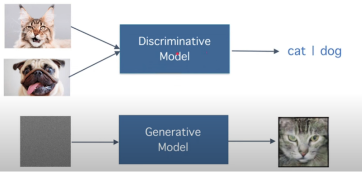
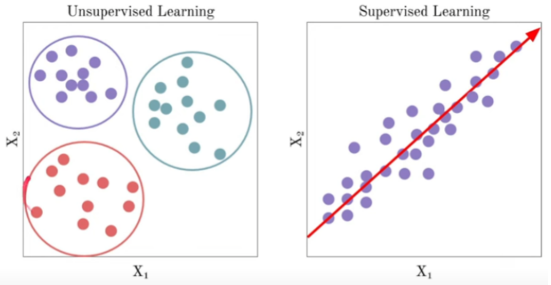

## Generative AI foundational

Generative AI - is the type of AI that allows you to create new original content rather than just analyzing and classifying the existing data or training sample. the content can include text, image, audio, video and any other media including 3D designing, synthetic modeling etc.

---

### Discriminative model

This  is a type of model that focuses on directly learning the decision boundary between different classes or categories in a dataset. Its primary goal is to classify or predict a label (Y) given an input (X) by modeling the conditional probability P(Y∣X).

Think of it like drawing a line or a complex surface that separates different groups of data points. When a new data point comes in, the model simply checks which side of the boundary it falls on to assign a label.

Primarily these are used to categorize and classify the data accurately.

Here's a breakdown of its key characteristics:

* **Focus on the Boundary**: Unlike generative models (which try to understand how the data itself is generated), discriminative models only care about the distinctions between classes. They don't try to model the full underlying distribution of the data.
* **Direct Prediction**: They directly learn the mapping from input features to output labels. They answer the question: "Given this input, what is the most likely class?"
* **Conditional Probability**: Mathematically, they estimate the conditional probability P(Y∣X), which is the probability of the label Y given the input X.
* **Supervised Learning**: Discriminative models are predominantly used in supervised learning tasks, meaning they require labeled training data (data where the correct output/label is already known).

Example for Discriminative model includes -  Logistic Regression, Support Vector Machine (SVM), Decision Trees, Random Forest, Traditional Neural Network.

---

### Why Generative AI models are required?

* **Understanding the complex pattern from the data** -  its hard to understand the pattern from unstructured data(audio, video data) without using ML model, but Generative AI model can easily do that.
* **Content generation** - it generates the content for you based on the topics you have provided
* **Build application** - you can not only build applications but also fix bugs using this.

---

### Where Generative Ai exists?

* Machine learning is a subset of Artificial Intelligence.
* Deep Learning is a subset of Machine Learning.
* Generative AI is a subset of Deep Learning. 

---

### Discrimintative VS Generative model

---

### Supervised and Unsupervised Learning

#### Supervised Learning

Supervised learning involves training a machine learning model on a labeled dataset. This means that for every input in the training data, there is a corresponding "correct" output or target label. The model learns to map inputs to outputs by identifying patterns and relationships in these input-output pairs. It's like a student learning with a teacher who provides corrected examples.

**How it Works**:

**1. Labeled Data**: You provide the model with a dataset where each data point has both input features (X) and a corresponding known output label (Y).
**2. Learning Mapping**: The algorithm learns a function that can predict the output label Y from the input features X. It tries to minimize the difference between its predictions and the actual labels.
**3. Generalization**: Once trained, the model can then be used to predict labels for new, unseen input data.

Examples include classification (output variable is a category of discrete value) -  spam detection, image classification, disease diagnosis
Regression (output variable is continuous value) - house price prediction, stock price forecasting, temperature prediction.

**Common Algorithms**:
* Linear Regression
* Logistic Regression
* Support Vector Machines (SVMs)
* Decision Trees
* Random Forests
* K-Nearest Neighbors (KNN)
* Neural Networks (often used in a supervised context for classification/regression)

#### Unsupervised Learning

Unsupervised learning deals with unlabeled data. There are no "correct" outputs provided during training. Instead, the algorithm's goal is to discover hidden patterns, structures, relationships, or insights within the data itself. It's like a student exploring a new topic without a teacher, trying to find inherent organizational principles.

**How it Works**:
**1. Unlabeled Data**: You provide the model with a dataset containing only input features (X), with no corresponding output labels.
**2. Pattern Discovery**: The algorithm analyzes the data to identify similarities, differences, and inherent groupings or underlying representations.
**3. Insight Generation**: The output is typically a representation of the data's structure, such as clusters, reduced dimensions, or identified associations.

* **Clustering**: Grouping similar data points together into clusters, where data points within a cluster are more similar to each other than to those in other clusters.
Examples: customer segmentation, document clustering(like sports technology etc), genomic analysis.
* **Dimensionality Reduction**: Reducing the number of features (variables) in a dataset while retaining as much important information as possible. This is useful for visualization, noise reduction, and speeding up other machine learning algorithms.
Examples: image compression, feature extraction
* **Association Rule Mining**: Discovering rules that describe relationships or co-occurrences between variables in large datasets.
Example: market basket analysis, recommendation systems
* **Anomaly Detection**: Identifying rare items, events, or observations that deviate significantly from the majority of the data.
Example: Fraud detection, network intrusion detection

**Common Algorithms**:
* K-Means Clustering
* Hierarchical Clustering
* Principal Component Analysis (PCA)
* Singular Value Decomposition (SVD)
* Apriori Algorithm (for association rules)
* Gaussian Mixture Models (GMMs)
* Autoencoders (a type of neural network for dimensionality reduction and generation)

---

Generative AI is a subset of Deep Learning and Generative models are trained on huge amount of data. while training these models we do not need to provide any labeled data, it is not possible when we have a huge amount of data.

***In Generative AI we use unstructured data to the LLm model for training purpose***. If the unlabeled data is given to the generative AI model, it tries to create the cluster based on the data.  that’s how its able to generate the new data for you based on the training data.