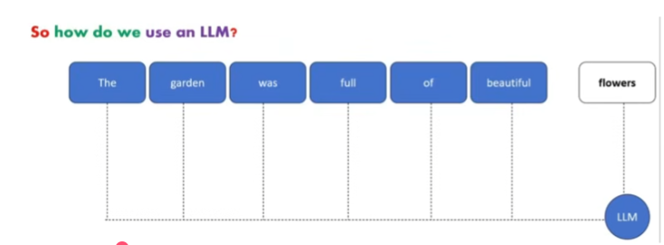
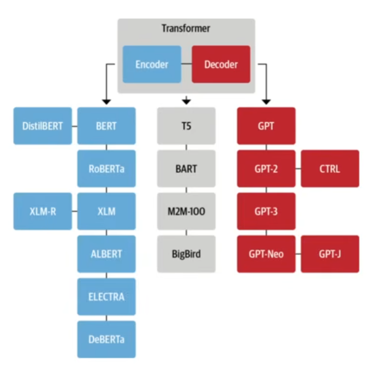

# What is LLMs?

A large laguage model is a trained deep learning model that understands and generates text in human like fashion.

LLM are good at understanding and generating human language.

here its trying to generate the next word, "flowers".

## 💡 Why It's Called a Large Language Model (LLM)

We call it an LLM because of its enormous size in two key areas:

1. **Large Brain (The Neural Network)**

    The model has billions of parameters (the network's internal 'weights' or connections). This vast size gives it the capacity to learn extremely complex patterns in language.

2. **Large Feed (The Training Data)**

    It's trained on a massive amount of text—often trillions of words from the entire public internet. This exposure to nearly all human writing makes it a general expert in language.

The result of combining this massive size and huge data feed is that the model gains emergent abilities; it can understand and generate human language, write code, and reason in ways that smaller models simply cannot.

---

## 🏗️ LLM model core architecture

The core architecture of Large Language Models (LLMs) is the Transformer, a type of neural network architecture invented by google, introduced in the 2017 paper Attention Is All You Need. It fundamentally changed NLP by relying entirely on the self-attention mechanism to process input data, replacing the need for traditional Recurrent Neural Networks (RNNs) or Convolutional Neural Networks (CNNs).

### 💡 Simple Takeaway: Transformer Architecture

The Transformer is the core blueprint for LLMs. It works by replacing old, sequential processing methods with a mechanism called Self-Attention.

**Self-Attention**: This is the key. It lets the model look at every word in a sentence at the same time to understand the context of each word. For example, it figures out if "bank" means a river bank or a money bank by looking at the words around it.

**Encoder-Only**: Models like BERT use this part to understand and analyze text.

**Decoder-Only**: Models like GPT use this part to generate or write new text, which is what most large LLMs do.

---

## Few milestones in Large language model.

* **Gemini**: developed by Google.

* **GPT**:  stands for ***Generative pre-trained tranformer*** the model was developed by Open-AI.

* **XLM**: Cross-lingual Language Model pre-training by Guillaume Lample, Alexis Conneau.

* **Llama**:  Created by Meta-AI

* **Megatron**: its a large, powerful transformer developed by the Applied Deep Learning Research team at NVDIA.

* **M2M-100**: multilingual encoder-decoder (seq-2-seq) model developed by researchers at Meta-AI.

if you want to get more information on LLMs including check point, research papers - check this out.
https://github.com/eugeneyan/open-llms

---

## Transformer tree
Here it shows which of the models are using encoder, decoder or both.

---

## OpenAI Based LLM models

| MODELS | DESCRIPTION |
| :--- | :--- |
| GPT-4 | A set of models that improve on GPT-3.5 and can understand as well as generate natural language or code. |
| GPT-3.5 | A set of models that improve on GPT-3 and can understand as well as generate natural language or code.
| GPT base | A set of models without instruction following that can understand as well as generate natural language or code. |
| DALL·E |A model that can generate and edit images given a natural language prompt. |
| Whisper | A model that can convert audio into text. |
| Embeddings | A set of models that can convert text into a numerical form. |
| Moderation | A fine-tuned model that can detect whether text may be sensitive or unsafe. |
| GPT-3 (Legacy) | A set of models that can understand and generate natural language. |

to keep up to date with gpt model check this out - https://platform.openai.com/docs/models

---

## Other open-source models (available on hugging face)

The Hugging Face platform hosts hundreds of thousands of open-source models. The models that are considered "top" are constantly changing based on new releases and leaderboard performance.

These include Mistral, Gemini, Claude, Falcon, Deepseek, MPT-30B, Stablem etc
 
 you can check them out in https://huggingface.co/models

 ---

 ## What can LLM be used for?

 * Text Classification

 * Text Generation

 * Text Summarization

 * Conversation AI like chatbot, Question Answering

 * Speech recognition and Speech identification

 * Spelling Corrector
 So on……

 ---

 ## 🎨 Prompt Designing

Prompt Designing (or Prompt Engineering) is the whole art and science of figuring out how to write and format the input text (known as a prompt) to get Large Language Models (LLMs) to perform a specific task or produce a desired output.

The goal is to shape the input so the LLM understands the context, constraint, and expected format of the desired response.

**Basic Examples**

Prompts fundamentally rely on the LLM's training to complete patterns or follow instructions:

| Type of Prompt | Input (Prompt) | Expected LLM Completion |
| :--- | :--- | :--- | 
|Pattern Completion | "It's raining cats and..." | "...dogs." | 
|Simple Calculation/Logic | "I have two apples and I eat one, I'm left with..." | "...one apple." |
|Instruction | "Write a short summary of the American Civil War." | [Generates a concise summary] |

---

## 💡 Key Types of Prompt Design

The following types range from the simplest (Zero-Shot) to the most complex (Chain-of-Thought).

### 💡 Zero-Shot Learning

The approach using a single command to get an LLM to take on a behavior is called Zero-Shot Learning.

Examples:

Prompt: "Write me a poem about Ada Lovelace in the style of Shakespeare"

Prompt: "Explain the Quantum Physics to me like I'm five years old"

### 📚 Few-Shot Learning

In addition to just providing an instruction, it can be helpful to show the model what you want by adding examples. This is called Few-Shot Learning because we showed the model a few examples.

First, we provide an instruction, for example, Convert the text from English to French. Then we give some examples establishing the text pattern 

1. Instruction
    Command: Convert the text from English to French

2. Examples Establishing the Text Pattern
    Examples:

    Peppermint: menthe poivrée

    Desert cactus: Cactus du désert

    Potato: pomme de terre

    Lipstick: Rouge à lèvres

    Orange Juice: du jus d'orange

    Sparkling water: Eau gazeuse

### Chain-of-Thought (CoT) Prompting

This technique encourages the LLM to display its reasoning steps before providing the final answer. You achieve this by adding phrases to the prompt or by including examples that show the step-by-step thinking process.

* **Format**: [Instruction] + "Let's think step by step." OR [Example Input -> Step-by-Step Reasoning -> Final Output] + [Final Input]

* **Example**: "If a person buys 10 items at $2 each and a coffee for $4, what is the total cost? Let's think step by step."

* **Use Case**: Crucial for improving performance on complex reasoning tasks, mathematical problems, and multi-step logic, as it forces the model to structure its thought process.

### Role Prompting

You assign a specific persona, role, or identity to the LLM to constrain its knowledge, tone, and style.

* **Format**: "Act as a professional Shakespearean actor and write a sonnet about modern technology."

8 **Use Case**: Used to define the style and constraints of the output, ensuring the LLM replies as a specific expert (e.g., a historian, a poet, or a Python programmer).

### Instruction Prompting (The Standard)

While not always listed as a separate "type," this refers to the fundamental design principle of ensuring your instructions are clear, specific, and well-structured. This involves defining constraints, format, tone, and length.

* **Example**: "Summarize the document in three bullet points, maintaining a formal, academic tone, and focusing only on the financial risks."

* **Use Case**: Essential for all prompts to ensure predictable and high-quality output.

---