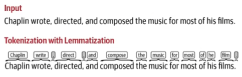
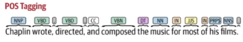
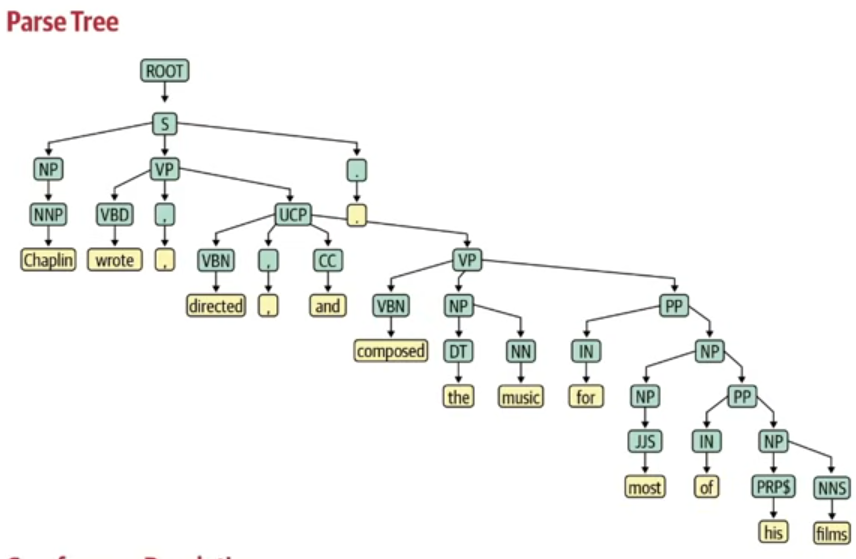

# Large Language Models (LLMs)

These are foundational machine learning models that usedeep learning algorithms to process and understand natural language, these models are trained on massive amount of text data to learn patterns and entity relationships in the language.

This is the type of generative AI models that specializes in undestanding, generating and interacting in human language. its responsible to perform tasks such as text to text generation, text to image generation and image to text generation.

### what makes LLMs so powerful?

In case of LLM, one model can be used for variety of tasks like text generation, chatbot, summarizer, translation code generation and so on.
its called ***multimodal*** as it can perform multiple tasks.

So LLM is subset of Deep Learning and it has properties that merge with Generative AI.

Some examples for LLM models include, gemini, GPT, XLM, T5, Llama, Mistral, Falcon etc.

---

## End to end Generative AI pipeline.
 
it consists of steps used to build end to end GenAI software.

Break the problem down into several sub-problems, then try to develop step by step procedure to solve them. Since language processing is involved we would also list all the forms of text processing needed in each step. This step by step processing of text is known as pipeline.

This includes
* Data aquisition
* Data preparation
* Feature Engineering
* Modeling
* Evaluation
* Deployment
* Monitoring and model updating.

---

### 📊 Data aquisition

First, we need to assess our current data availability. We'll check for any existing data files in common formats such as CSV, DOCX, XLSX, PDF, or TXT.

1. **External Data Sources**: If internal files are insufficient, we will explore external data sources. This includes:

    * Querying databases (DB).
    * Searching the internet for publicly available datasets.
    * Utilizing APIs to collect data programmatically.
    * Implementing web scraping techniques.

2. **Data Generation and Augmentation**: In the event we find ***no existing data***, we will proceed to ***create our own dataset***, potentially leveraging tools like the OpenAI API for generation.

If we have ***limited data***, we will ***perform data augmentation*** to expand the dataset size and variety, ensuring we have enough information for robust analysis or model training.

3. **Textual Data Augmentation**

Textual augmentation methods modify the existing text to create diverse variations while preserving the original meaning:

*   * **Synonym Replacement**: Swap words with their ***synonyms*** (e.g., "I am AI engineer" becomes "I am artificial intelligence engineer").

    * **Bigram Flip**: ***Swap adjacent word pairs*** to introduce grammatical variations, helping models become more robust to incorrect syntax (e.g., "I am going to the supermarket" becomes "I am to going the supermarket").

    * **Back Translation**: Translate the text to one or more foreign languages and then ***translate it back*** to the original language. This generates a paraphrased, non-identical version of the original sentence. This technique is most effective with larger datasets.

    * **Adding Noise/Context**: Append a small, ***contextually relevant sentence or phrase to the original text*** (e.g., "I am a data scientist" becomes "I am a data scientist**, i love my job**").

4. **Image Data Augmentation**

Image augmentation applies transformations to images to increase the quantity and variability of the training data:

*    * **Geometric Transformations**:

        * Flips: Horizontal flip, Vertical flip.
        * Rotation: Positive and negative rotation.
        * Crop: Random cropping.

     * **Color/Pixel Manipulations**:

        * Brightness and Contrast adjustments.
        * Color Space Conversion: Convert to Grayscale.
        * Blur and Noise addition.

---

### 🧹 Data Preprocessing

Data preprocessing transforms raw, unstructured data into a clean, structured format suitable for model training.

1. **Cleanup Operations**

These are initial steps to remove irrelevant or problematic elements from the raw data:

*   * **Remove HTML Tags and Emoji**: Eliminating web formatting and non-textual symbols.
    * **Spelling Correction**: Fixing typos to ensure word consistency.

2. **Basic Preprocessing**
These steps prepare the text for tokenization and further analysis.

*   * **Tokenization**: Breaking down text into smaller units (tokens).

    * **Word-Level Tokenization**: Splits text into individual words, the most common form (e.g., ["my", "name", "is", "megha"]).
    
    * **Sentence-Level Tokenization**: Splits text into complete sentences.

    * **Lowercase Conversion**: Converting all text to lowercase (e.g., "Bappy" and "bappy" become "bappy") so the computer recognizes them as the same word, which is crucial for reducing dimensionality and ensuring consistency.

    * **Punctuation Removal**: Removing symbols like ?, ., and ;.

    * **Language Detection**: Identifying the primary language of the text.

3. **Optional Preprocessing**
These steps aim to reduce complexity and improve model focus.

*   * **Stop Word Removal**: Removing common, low-information words (e.g., "the," "a," "is").

    * **Stemming (Less Used)**: Reducing a word to its root form by chopping off the end (e.g., "playing," "played," "plays" -> "play"). The result may not be a valid dictionary word, but it helps reduce dimensionality.

    * **Lemmatization (Popular)**: Reducing a word to its basic dictionary form (lemma). It's more precise than stemming, always resulting in a valid word, as it considers context (e.g., "better" -> "good").

    

4. **Advanced Preprocessing (NLP)**
These steps analyze the grammatical and structural relationships within the text.

*   * **Part-of-Speech (POS) Tagging**: Assigning a grammatical category (like Noun, Verb, Adjective) to each word based on its context, which aids in understanding the word's function.

    

    * **Parsing (Syntactic Parsing)**: Analyzing the hierarchical grammatical structure of a sentence.

    * **Constituency Parsing**: Breaks the sentence into nested phrases (e.g., Noun Phrase, Verb Phrase).

    * **Dependency Parsing**: Shows the grammatical relationships between words as directed links (e.g., subject, object).

    

    * **Coreference Resolution**: Identifying and grouping all mentions (pronouns, nouns, phrases) that refer to the same real-world entity within a text (e.g., linking "John" and "He").

    

---

### ⚙️ Feature Engineering & Vectorization

Feature Engineering transforms raw data into a set of informative features that machine learning models can process effectively.

* **Text Vectorization**: Converting text into numerical vector representations that models understand.

**Bag-of-Words (BoW) and TF-IDF**: Traditional methods that represent text based on word frequency.

**Word2Vec/GloVe**: Embeddings that capture semantic relationships between words.

**Transformer Models**: State-of-the-art models (like BERT, GPT) use complex encoder-decoder architectures to create dense, context-aware vector representations (embeddings).

**Image Vectorization**: For image data (pixels), Vision Transformer (ViT) models are used to convert the raw pixel information into a meaningful vector representation.

---

### 🧠 Modeling
After preprocessing and feature engineering, the data is used to train a model.

* **Open Source LLMs (Large Language Models)**: These models can be downloaded and run locally or on a private server, offering full control. This requires substantial computational resources (CPU, memory, and powerful GPU) for training and deployment.

* **Paid Models**: These models are accessed via an API (Application Programming Interface), eliminating the need for local download or dedicated high-end hardware for training or inference.

---

### 🧐 Model Evaluation
Model evaluation ensures the model performs as expected and meets required standards.

1. **Intrinsic Evaluation (Offline Metrics):**

    * This evaluation is performed by the GenAI Engineer or Data Scientist before deployment using held-out test data.

    * It relies on statistical metrics to measure the model's performance on core tasks.

    * Common Metrics Include: Accuracy, Precision, Recall, F1 Score (for classification), Perplexity (for language models), and BLEU Score (for machine translation/text generation).

2. **Extrinsic Evaluation (Live/In-Production Metrics)**:

    * This evaluation is conducted after the model is deployed and is based on its performance in a real-world setting.

    * It often measures the impact on a downstream task or business objective.

    * It frequently involves collecting user feedback (e.g., asking if the user liked the application's output) and monitoring key business metrics.

---

### 🚀 Model Deployment, Monitoring, and Retraining
Deployment is the process of making the model available to end-users or other systems.

It involves integrating the final, trained model into a production environment (like a cloud platform or application server).

Deployment also includes crucial ongoing phases:

Monitoring: Continuously tracking the model's performance in production to detect issues like model drift (where performance degrades over time due to changing data patterns).

Retraining: Periodically or automatically updating the model with new data to maintain its accuracy and relevance.