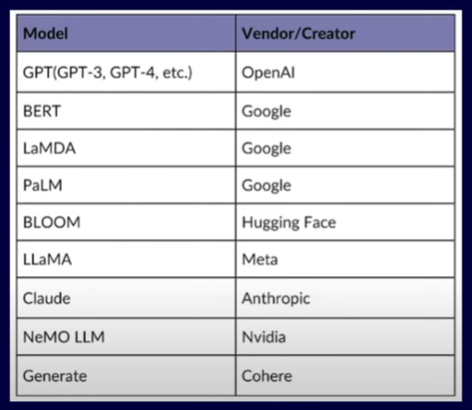

# Prompt Engineering

Prompt Engineering is the discipline of structuring and optimizing input instructions (prompts) to reliably elicit desired, high-quality outputs from a Large Language Model (LLM) or other generative AI model. It bridges the gap between human intent and machine execution, transforming simple queries into targeted and constrained commands.

##  🎯 Core Tasks of Prompt Engineering

Prompt engineering is an iterative and continuous process essential for maximizing the utility and consistency of generative AI applications:

* Writing, Refining, and Optimizing Prompts: Involves careful selection of keywords, framing, and structure to guide the model's behavior and focus its output.

* Perfecting Human-AI Interaction: Designing prompts that facilitate multi-turn, coherent, and contextual conversations, ensuring the model understands the user's ultimate goal.

* Continuous Monitoring of Prompts: Evaluating the performance of prompts in production against defined metrics (e.g., accuracy, relevance, compliance) to detect drift or degradation.

* Maintaining an Up-to-Date Prompt Library: Documenting, versioning, and managing a collection of tested, high-performing prompts for various tasks to ensure reusability and scale.

---

## 💡 Why Prompt Engineering is Necessary (Illustrative Examples)
The difference between a simple query and an engineered prompt is the difference between an ambiguous result and a controlled, targeted outcome.

1. Simple Correction (Minimal Context)
| Prompt Type | Prompt Text |	Result Expectation |
| :--- | :--- | :--- |
| Simple Query | 	prompt1 = correct my paragraph: "today was great day in the world for me i went to Disneyland with my mom. I coukd have been better if it wasnt raining" | The model makes basic spelling and grammar fixes, but the style, tone, and sentence structure are left to its default decision. |

2. Role-Based, Constrained Prompt (Interactive Mentor)
This prompt transforms the LLM into a dedicated, constrained agent for a specific educational task.

| Component | Instruction (Prompt 2) | Purpose | 
| :--- | :--- | :--- |
| Role Definition | "I want you to act as spoken english teacher." | Assigns a persona, immediately setting the tone and domain expertise. |
| Core Task |"I will speak with you in english and you will reply to me in english to practice my spoken english." |Defines the function of the interaction (practice conversation). |
| Output Constraints | "I want you to keep your reply neat, limiting the reply to 100 words..." | Explicitly restricts the length and format of the output. |
| Strict Behavioral Rules | "...i want you to strictly correct my grammar mistakes and typos... Remember, I want you to strictly correct my grammar mistakes, typos and factual errors" | Emphasizes critical quality control requirements (correction). |
| Call to Action | "...i want you to ask me a question in you reply. now let's start practicing, you could ask me a question first." | Ensures the conversation remains interactive and goal-oriented. |

The key value of Prompt 2 is that its detailed instructions and constraints ensure a more interactive, useful, and consistent output from the LLM model, elevating it from a simple text corrector to a guided mentor.

---

## Linguistics 

The study of language, this is the key to the prompt engineering.

* Phonetics: The study of how speech sounds are produced and perceived. It looks at the physical production of sounds by vocal organs.

* Phonology: The study of sound patterns and changes. This is the study of the patterns of sounds in a language and how they are organized in the mind to convey meaning.

* Morphology: The study of word structure. It is concerned with the internal structure of words and how they are formed from smaller units of meaning called morphemes.

* Syntax: The study of sentence structure. It refers to the rules that govern the arrangement of words and phrases to form well-structured sentences.

* Semantics: The study of linguistic meaning. It focuses on understanding what meaning is as an element of language in isolation.

* Pragmatics: The study of how language is used in context.

* Historical: The study of language change.

* Sociolinguistics: The study of the relation between language and society.

* Computational: The study of how computers can process human language.

* Psycholinguistics: The study of how humans acquire and use language.

---

## Generative AI models (LLMs)

This table lists several prominent Large Language Models (LLMs) and their respective creators or vendors.

## Best practices to design a prompt

* **Clear Instruction**: The prompt must contain clear and unambiguous instructions. This is the most crucial step, as vague instructions will lead to inconsistent or irrelevant output. The model needs to know precisely what task it is meant to perform.

* **Adopt a Person**a: Giving the model a specific role or persona (e.g., "Act as a senior software engineer" or "You are a concise financial analyst") improves the quality and tone of the response. It constrains the model's stylistic output to match the expected expertise.

* **Specify the Forma**t: Clearly defining the desired output format (e.g., "Respond in a JSON format," "Provide a markdown table," or "List the answers in bullet points") ensures the response is structured and easy for downstream systems or humans to parse.

* **Avoid Leading the Answer**: Your prompt should not contain assumptions or hints that bias the model toward a specific answer. Asking a leading question can cause the model to affirm your premise rather than critically analyze the information.

* **Limit the Scope**: Keep the prompt focused on a single, well-defined task or topic. Restricting the scope helps prevent the model from drifting into irrelevant topics or generating excessively long and costly responses.

---

## Types of Prompts

Zero-shot and few-shot are two primary techniques used in prompt engineering to leverage the inherent knowledge of large language models (LLMs) without requiring any formal fine-tuning. Both methods rely on providing clear instructions within the prompt itself.

**🎯 Zero-Shot Prompting**

* Definition: Zero-shot prompting involves giving the LLM an instruction and expecting it to generate the desired output without providing any examples.

* Mechanism: The model uses the vast amount of general knowledge it acquired during its pre-training phase to complete the task.

* Use Case: This method works best for general tasks that the model has seen frequently, such as translation, summarization, or simple question-answering.

* Example: "Translate the following English sentence to French: 'The cat sat on the mat.'"

**💡 Few-Shot Prompting**

* Definition: Few-shot prompting involves giving the LLM the instruction along with a few complete, high-quality examples of the task and its expected output.

* Mechanism: The model uses these examples within the prompt as an in-context learning mechanism to infer the pattern, style, or specific constraints you want the final answer to follow.

* Use Case: This method is necessary for more complex, niche, or domain-specific tasks where the model needs to understand a specific format, jargon, or non-obvious pattern.

* Example: Providing several input-output pairs showing how to convert financial transactions into a specific JSON format, and then giving a final transaction for the model to convert.

---

## AI Hallucination

AI hallucination is a critical term used to describe a phenomenon where a generative AI model, particularly a Large Language Model (LLM), produces output that is factually incorrect, nonsensical, or completely fabricated, yet is presented with high confidence and often sounds fluent and plausible.

The term is metaphorical; the AI is not experiencing human-like delusions, but rather its underlying mathematical and probabilistic design leads it to generate errors.

### **📉 Key Characteristics**

*    * **Plausible but False**: The output is typically grammatically correct and contextually coherent, making it difficult for a human to immediately detect the falsehood.

     * **Confidently Wrong**: The model often presents the fabricated information with the same authoritative tone it uses for verified facts, without indicating uncertainty.

     * **Examples**: Fabricating legal case law that does not exist, citing non-existent research papers, inventing false financial data, or suggesting incorrect code functions.

### **🛑 Primary Causes**

Hallucinations are fundamentally a side effect of how LLMs are designed to predict the most probable sequence of words (tokens) based on patterns, not truth.

*   * **Training Data Issues**: The massive datasets used for training can contain errors, biases, inconsistencies, or outdated information, which the model learns and reproduces.

    * **Inherent Design Limits**: The model's primary goal is fluency and coherence, not factual accuracy. When it encounters a knowledge gap, it fills the void by inventing the most statistically plausible phrase.

    * **Lack of Grounding**: LLMs lack direct experience of the physical world or the ability to access real-time, verified facts unless explicitly provided (unlike a human who can conduct an experiment or consult a verified source).

    * **Uncertainty Handling**: Unlike humans, LLMs lack a mechanism to simply say "I don't know" when information is sparse or conflicting, leading them to generate a confident guess.

### **✅ Mitigation Strategies**

*    * **Retrieval-Augmented Generation (RAG)**: The most effective method, where the model is provided with retrieved, verified information from a trusted external database (like a company's internal documents) at query time. This "grounds" the response in fact.

     * **Advanced Prompting**: Using techniques like Chain-of-Thought (CoT) prompting, which forces the model to break down its reasoning step-by-step, exposing logical flaws before the final answer is given.

     * **Fine-Tuning**: Training the model on highly accurate, domain-specific data to teach it the correct facts and discourage unsupported guessing.

     * **Parameter Adjustment**: Setting lower Temperature values to reduce the model's randomness and push it toward the most likely (and often most factual) response.

    