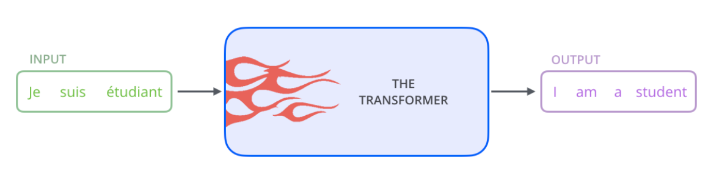
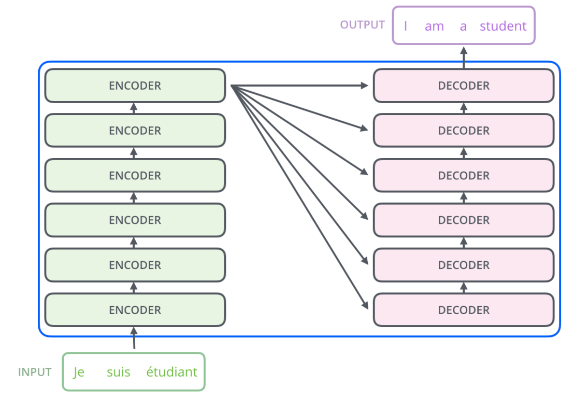
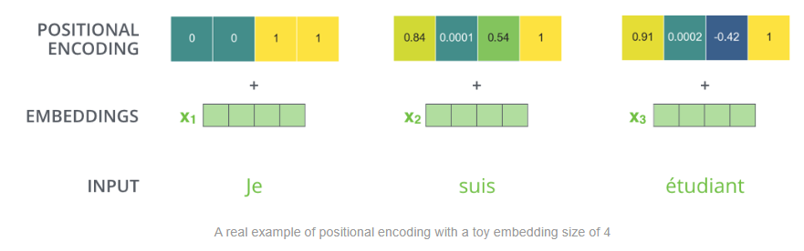
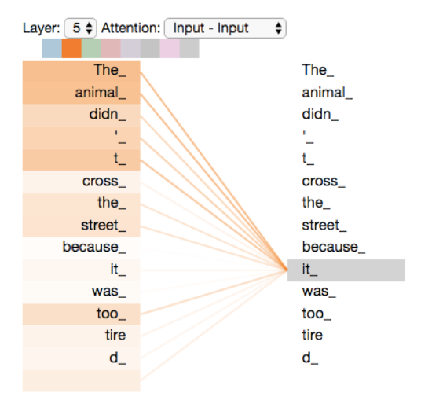
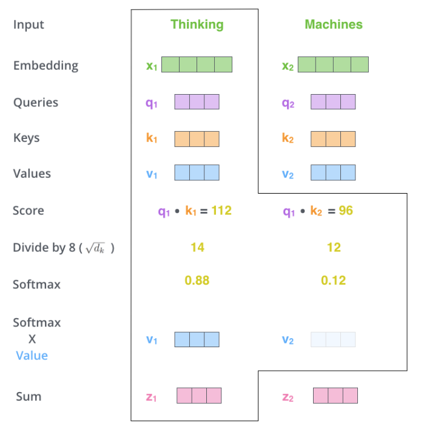
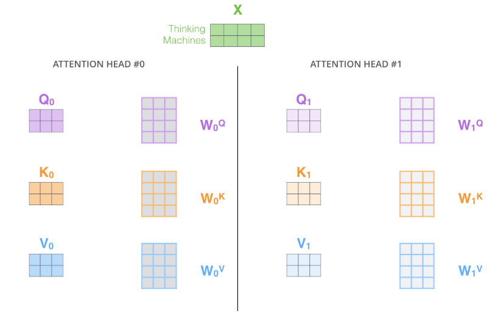
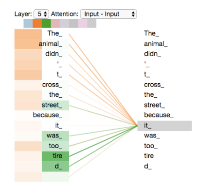
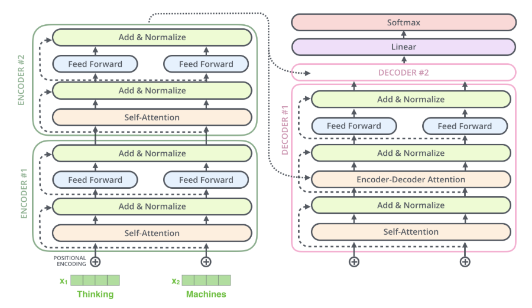

# In depth intution of transformer.

you can find the paper for ***Attention is all you need*** here - https://proceedings.neurips.cc/paper_files/paper/2017/file/3f5ee243547dee91fbd053c1c4a845aa-Paper.pdf

Also refer to this to have visual understanding of transformer architecture: https://jalammar.github.io/illustrated-transformer

1. **High-Level View (The Black Box)**

    At its most basic, the Transformer is a sequence-to-sequence model. It takes an input sequence and transforms it into an output sequence, such as translating a sentence from one language to another.

    

    The architecture is composed of two main stacks:

    **Encoder Stack**: A stack of identical Encoders that processes the input sequence to understand its meaning and context.

    **Decoder Stack**: A stack of identical Decoders that uses the Encoder's output to generate the output sequence one word at a time.

    

2. **Input Preparation**

    Before the data enters the Encoder stack, two key steps prepare it for parallel processing:

    **Word Embeddings**: Each word in the input sentence is first converted into a numerical vector. This vector is a dense representation of the word's meaning.

    **Positional Encoding**: Because the Transformer processes all words simultaneously (unlike older models that process one-by-one), it loses the order of the words. Positional Encoding is a small vector added to the word embedding to tell the model exactly where the word is located in the sequence.

    

3. **The Encoder (Understanding Context)**

    Each Encoder block is built around the Self-Attention Mechanism, which is the core innovation of the Transformer.

    **Self-Attention**: 
    This mechanism allows the model to look at other words in the same sentence to find contextual clues for any given word.

    **Finding Context**: If the model sees the sentence, "The animal didn't cross the street because it was too tired," the Self-Attention mechanism calculates scores that strongly link "it" to "animal," clarifying the meaning for the co
    
    
    
    Query, Key, and Value (Q, K, V): For every word vector, the model creates three derived vectors:

    **Query (Q)**: What I am looking for.

    **Key (K)**: What I can offer.

    **Value (V)**: The actual information (content) I contain.

    **Calculating Attention Scores**: To find the context for a word, the model compares its Query against the Keys of all other words. This comparison produces a score that determines how much focus should be placed on each word.

    **Weighted Sum**: These scores are normalized and multiplied by the Values (content) of the other words. The resulting vectors are summed up to create a new, context-aware representation for the original word.

    

    **Multi-Head Attention**:
    Instead of using just one set of Q, K, and V vectors, the model uses multiple independent sets (e.g., eight "heads") in parallel. Each head learns to focus on a different aspect of the sentence (e.g., one head might look for grammatical relationships, another for semantic meaning), leading to a much richer and more comprehensive representation of the input.

        

    after processing multi head attention, its able capture the semantic meaning well.

    

4. **The Decoder (Generating Output)**

    The Decoder is responsible for generating the final output sequence, word by word. It has three main components:

    **Masked Self-Attention**: This layer works just like the Encoder's self-attention but is masked to prevent it from looking ahead at future words in the output sequence. This ensures the model generates the sequence in the correct, ordered manner.

    **Encoder-Decoder Attention**: This layer helps the Decoder focus on the most relevant parts of the input sentence (the Encoder's output) while generating the current output word.

    

    **Add Normalization**: It combines two distinct operations: a Residual Connection (the "Add") and Layer Normalization (the "Norm").
    *    * **The "Add" (Residual Connection)**: This component uses a Residual Connection, which is a direct link that skips over the sub-layer and adds its input to its output.
         * **The "Norm" (Layer Normalization)** : Layer Normalization is applied immediately after the Residual Connection (the "Add") to stabilize the values within the network.

    **Linear and Softmax**: The final vector output by the Decoder stack is passed through a Linear layer and a Softmax layer. This converts the numerical vector into a probability distribution over the entire vocabulary (all known words), and the word with the highest probability is chosen as the next word in the final output.
    
    https://jalammar.github.io/images/t/transformer_decoding_2.gif

---

