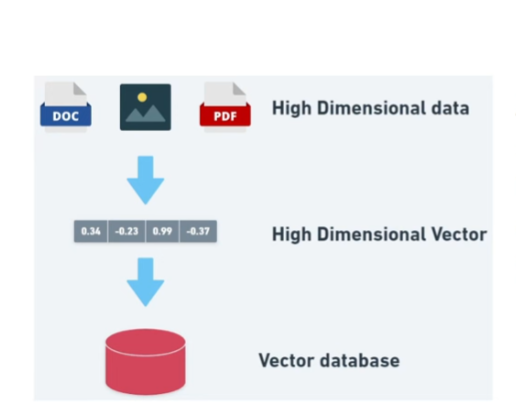
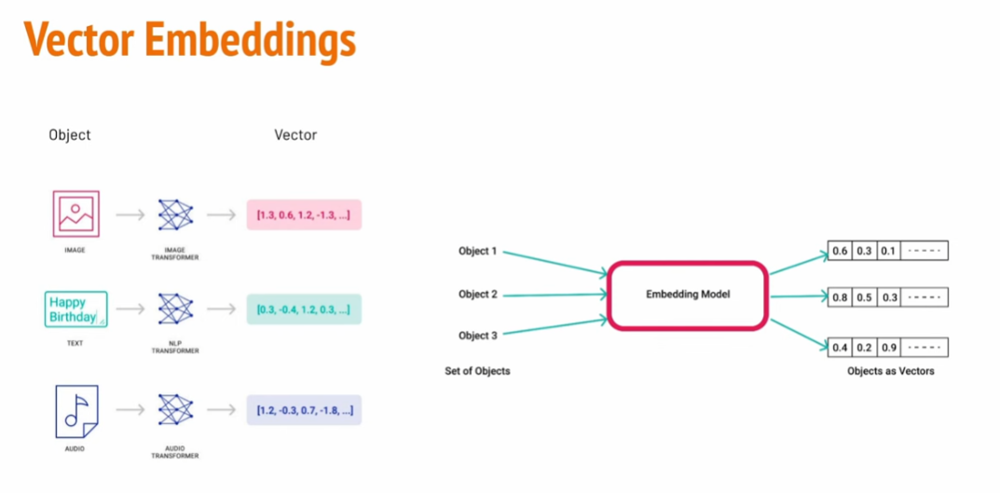
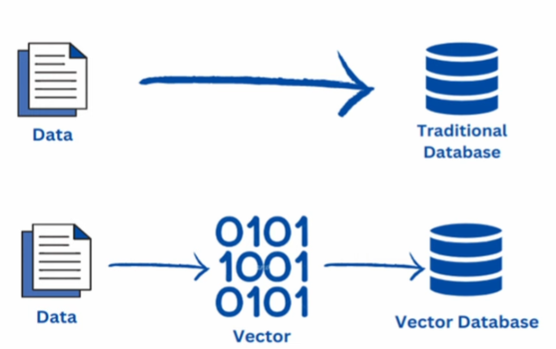
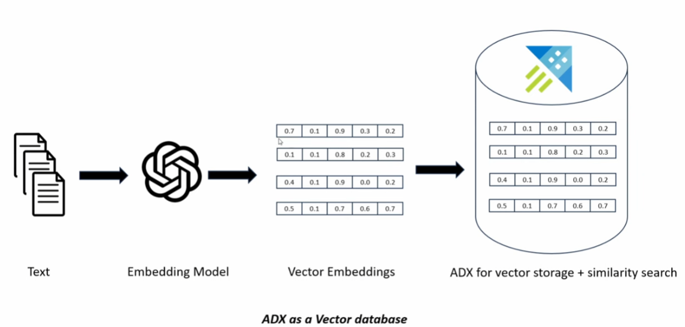
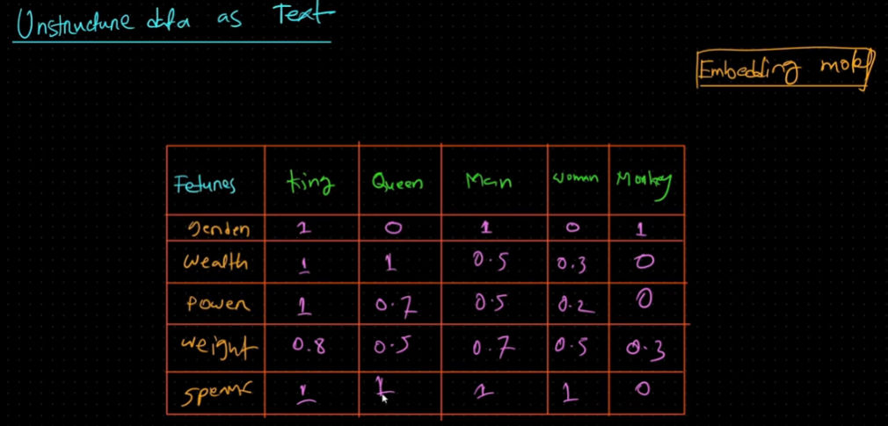
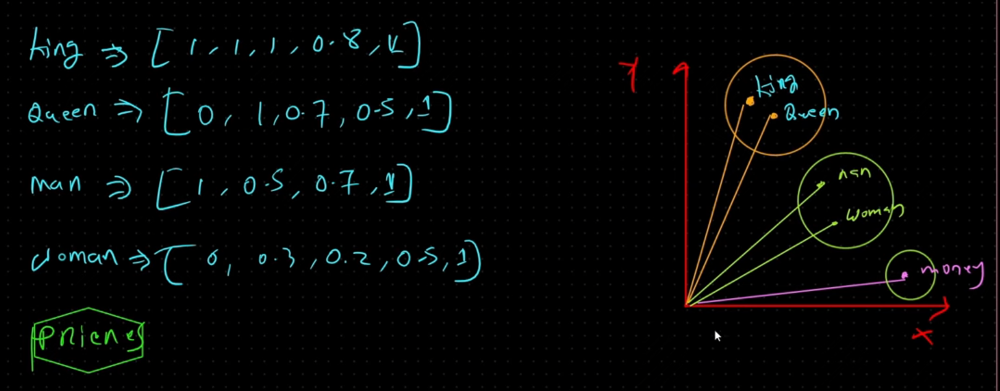
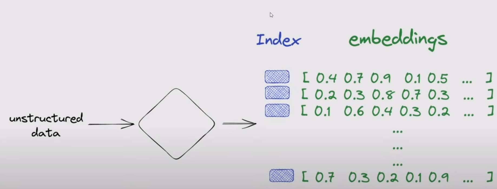
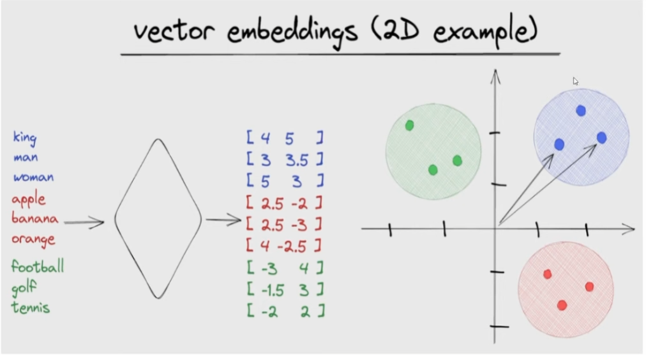

# Vector Databases

Vector databases are a specialized type of database designed to efficiently store, manage, and retrieve vector embeddings. They are essential infrastructure for modern AI applications, particularly those leveraging Large Language Models (LLMs) and performing similarity searches.

---

## 💡 What They Store

Vector databases store vector embeddings, which are dense numerical representations of data (like text, images, audio, or video) in an N-dimensional space. These vectors are generated by machine learning models (like embedding models) where the numerical proximity of the vectors reflects the semantic similarity of the underlying data.

Example: The embedding vector for "dog" will be mathematically closer in the vector space to the embedding for "puppy" than to the embedding for "truck."

## Why Vector Databases are Needed

Over 80-85% of data is unstructured and cannot be efficiently managed by traditional relational databases (which rely on rigid schemas and exact keyword matching).

*    * **Traditional Issue**: Storing images in a relational database requires manual schema creation (e.g., animal, color, tags), which is inefficient for complex querying.

     * **Vector Solution**: By converting unstructured data (text, images, audio, video) into vectors using an embedding model, the database can manage and query the data based on its meaning rather than manual tags.

---

## ⚙️ How They Work (Approximate Nearest Neighbor)

Traditional databases use exact matching (like SQL WHERE clauses). Vector databases, however, are optimized for Approximate Nearest Neighbor (ANN) search.

*    * **Indexing**: They use special algorithms and data structures (like Hierarchical Navigable Small World, or HNSW) to index millions or billions of high-dimensional vectors.

     * **Query**: When a user inputs a query (e.g., a search term), that query is first converted into its own embedding vector.

     * **Search**: The vector database rapidly searches its index to find vectors that are closest (i.e., most similar in meaning) to the query vector, using distance metrics like cosine similarity or Euclidean distance.

     * **Retrieval**: It returns the original data (or metadata) associated with those closest vectors.

**Vector DB vs. Traditional DB**: Vector databases index and store vector embeddings for faster retrieval and similarity search, unlike traditional databases that index structured columns for exact matches.

---
## Vector Embedding - an example.

The embedding model identifies features from unstructured data (like text, images, or audio) through a process called representation learning, primarily using complex neural network architectures (such as Transformers and CNNs) trained on massive datasets.

The key idea is that the neural network learns to compress the high-dimensional, complex raw data into a fixed-size, low-dimensional vector where distance reflects meaning.

Here is an example for text data where we use embedding model to convert to text vectors, then we will use vector database to store these embeddings one by one.

The model doesn't manually identify features; it learns them automatically through its training objective.
* **pretraining (Self-Supervised Learning)** :Guessing a masked-out word based on the surrounding context.
* **backpropagation**: During training, the network iteratively adjusts the weights (the parameters within the model) to minimize prediction errors.

here is an example from  textual unstrctured data. 

same vectors in 2 dimensions.

Here is an example representation of unstructured data into vector embeddings.

Here is an example of representing unstrctured data into 2 dimensions.

---

## Embedding models

the different embedding models include:

* **Open AI Embedding model**: Trained on GPT model.
* **Hugging face Embedding model**: Trained on open-source LLMs.
* **LLAMA 2 Embedding model**: Developed by Meta.
* **Google palm embedding model**: Developed by Google.

---

## 🌟 Role in AI (Retrieval-Augmented Generation - RAG)

Vector databases are the core component of Retrieval-Augmented Generation (RAG) systems, which are crucial for mitigating AI hallucination.

* The vector database acts as the external knowledge base for the LLM.

* When a user asks a question, the vector database quickly retrieves relevant, verified document chunks.

* The LLM then uses this retrieved, factual context to generate its answer, ensuring the response is grounded in the provided information.

---

## Key Applications and Use Cases

Vector databases are now critical infrastructure for several major AI and data science applications.

**Retrieval-Augmented Generation (RAG)**
Role: The vector database acts as the external, verified knowledge base for LLMs.

* **Function**: When a user asks a question, the vector database retrieves the most relevant, factual document chunks. The LLM then uses this retrieved context to generate its answer, significantly reducing hallucinations and ensuring the response is grounded in the provided information.

**Other Use Cases**
*    * **Semantic Search**: Returning search results based on the meaning and context of the query, not just keyword matches.

     * **Similarity Search**: Finding similar items across all data types (text, images, videos, and audios).

     * **Long-Term Memory for LLMs**: Providing a persistent, searchable knowledge base beyond the LLM's initial training data or context window.

     * **Recommendation Engines**: Identifying users, products, or items that are semantically similar to others to provide accurate recommendations.

---
## Widely Used Vector Databases

**local vector databases**
*   * Chroma DB
    * Faiss (library)

**cloud based  vector databases**

*   * Weaviate
    * Pinecone
    * Neo4j (often used as a vector-enabled graph database)

---

